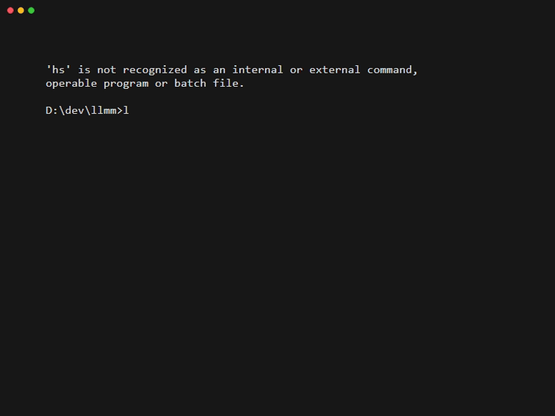

# LLMM — Large Language Model Manager

<p align="center">


<br>


</p>

<p align="center">

</p>

<p align="center">
LLMM is a command-line tool for managing a local library of <b>GGUF Large Language Models</b> from Hugging Face.<br>
It acts like a lightweight <b>package manager for local LLM models</b>, allowing you to define models in a YAML manifest and download them automatically.
</p>

---

## Why LLMM?

Managing local LLM models can quickly become messy:

- multiple quantizations
- large sharded GGUF files
- inconsistent folder structures
- manual downloads from Hugging Face

LLMM solves this by acting like a **package manager for local LLM models**.

Define your models once in a simple YAML manifest and LLMM will:

- download the correct GGUF files
- detect shards automatically
- fetch required `mmproj` files for vision models
- organize everything into a clean folder structure
- generate metadata for your model library

This makes it much easier to maintain a reproducible local LLM environment.

---

## Quick Example

```bash
llmm download --manifest sample_manifests/small.yaml --root ./GGUF
```

LLMM reads the manifest and automatically downloads the required GGUF model files, detects shards, and organizes them into a clean folder structure.

---

## Table of Contents

- [LLMM — Large Language Model Manager](#llmm--large-language-model-manager)
  - [Why LLMM?](#why-llmm)
  - [Quick Example](#quick-example)
  - [Table of Contents](#table-of-contents)
  - [Features](#features)
  - [Installation](#installation)
  - [Hugging Face Authentication (Optional)](#hugging-face-authentication-optional)
  - [Quick Start](#quick-start)
  - [Commands](#commands)
    - [`download`](#download)
  - [CLI Options](#cli-options)
  - [Manifest Format](#manifest-format)
  - [Model Folder Layout](#model-folder-layout)
  - [Example Output](#example-output)
  - [Roadmap](#roadmap)
  - [Acknowledgements](#acknowledgements)
  - [License](#license)

---

## Features

- Manifest-based model management
- Supports multiple quantizations
- Automatic GGUF shard detection
- Automatic **mmproj detection for vision models**
- Safe **dry-run mode**
- Optional **simulated progress bars**
- Colored CLI output
- Clean error reporting
- Download summary report
- Hugging Face token support
- Relative-path CLI output for cleaner logs

LLMM works with common local inference tools such as:

- llama.cpp
- KoboldCpp
- LM Studio
- MSTY
- SillyTavern
- any GGUF-compatible runtime

---

## Installation

Clone the repository:

```bash
git clone https://github.com/YOURNAME/llmm.git
cd llmm
```

Install dependencies:

```bash
pip install -r requirements.txt
```

Run LLMM directly:

```bash
python llmm.py
```

Optional: install as a CLI tool:

```bash
pip install .
```

Then run simply as:

```bash
llmm
```

For local development, an editable install is recommended:

```bash
pip install -e .
```

This lets the `llmm` command use your latest local code changes without reinstalling after every edit.

---

## Hugging Face Authentication (Optional)

LLMM supports Hugging Face tokens for:

- higher rate limits
- access to gated models
- more reliable downloads

Create a `.env` file:

```env
HF_TOKEN=hf_xxxxxxxxxxxxxxxxxxxxx
```

An example file is included:

```
.env.example
```

---

## Quick Start

Download models:

```bash
python llmm.py download --manifest sample_manifests/small.yaml --root ./GGUF
```

Dry run:

```bash
python llmm.py download -d --manifest sample_manifests/small.yaml --root ./GGUF
```

Dry run with simulated downloads:

```bash
python llmm.py download -d -s --manifest sample_manifests/small.yaml --root ./GGUF
```

If installed via pip:

```bash
llmm download --manifest sample_manifests/small.yaml --root ./GGUF
```

---

## Commands

### `download`

Download models defined in a manifest file.

```bash
llmm download --manifest sample_manifests/small.yaml --root ./GGUF
```

---

## CLI Options

| Option | Description |
|------|-------------|
| `--manifest` | Path to YAML manifest describing models |
| `--root` | Root directory where models will be stored (default `./GGUF`) |
| `-d`, `--dry` | Dry-run mode — simulate actions without downloading |
| `-s`, `--sim` | Simulate progress bars during dry runs |
| `-v`, `--verbose` | Enable verbose logging output |
| `--version` | Show LLMM version |

---

## Manifest Format

Models are defined using YAML.

Example:

```yaml
models:
  - name: Llama-3.2-3B-Instruct
    url: https://huggingface.co/bartowski/Llama-3.2-3B-Instruct-GGUF
    quants:
      - Q4_K_M

  - name: Qwen2.5-7B-Instruct
    url: https://huggingface.co/Qwen/Qwen2.5-7B-Instruct-GGUF
    quants:
      - Q4_K_M
```

Multiple quantizations:

```yaml
quants:
  - Q4_K_M
  - Q5_K_M
```

Or:

```yaml
quants: Q4_K_M, Q5_K_M
```

---

## Model Folder Layout

After downloading:

```
GGUF/

Llama-3.2-3B-Instruct/
 ├─ Llama-3.2-3B-Instruct-Q4_K_M.gguf
 └─ Llama-3.2-3B-Instruct.md

Qwen2.5-7B-Instruct/
 ├─ qwen2.5-7b-instruct-q4_k_m-00001-of-00002.gguf
 ├─ qwen2.5-7b-instruct-q4_k_m-00002-of-00002.gguf
 └─ Qwen2.5-7B-Instruct.md
```

Notes:

- Original Hugging Face filenames are preserved
- Sharded GGUF files are detected automatically
- Vision models automatically download **mmproj files**
- Metadata `.md` files are generated per model

---

## Example Output

```text
Installing Llama-3.2-3B-Instruct
  Repo: bartowski/Llama-3.2-3B-Instruct-GGUF

  ✔ Llama-3.2-3B-Instruct-Q4_K_M.gguf

✔ Installed Llama-3.2-3B-Instruct


Run Summary

Models total      3
Models succeeded  2
Models failed     1
Files planned     4
Files completed   3
mmproj files      1
```

---

## Roadmap

Possible future features:

- `llmm update`
- `llmm verify`
- `llmm cleanup`
- hardware-aware quant suggestions
- disk usage reporting
- automatic manifest generation
- model search and discovery

This is a **personal project** developed in my spare time, so development happens when time allows.

If you run into issues or have suggestions:

- open a GitHub issue
- start a discussion
- submit a pull request

Feedback and contributions are always welcome.

---

## Acknowledgements

This project was developed with assistance from **ChatGPT (OpenAI)** for design guidance, code refinement, and documentation support.

---

## License

MIT License